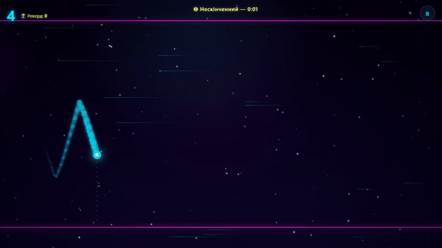
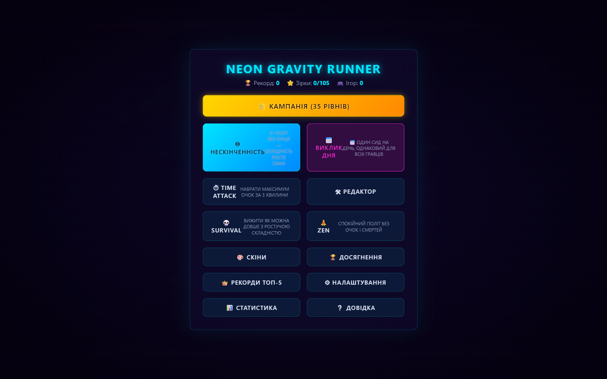
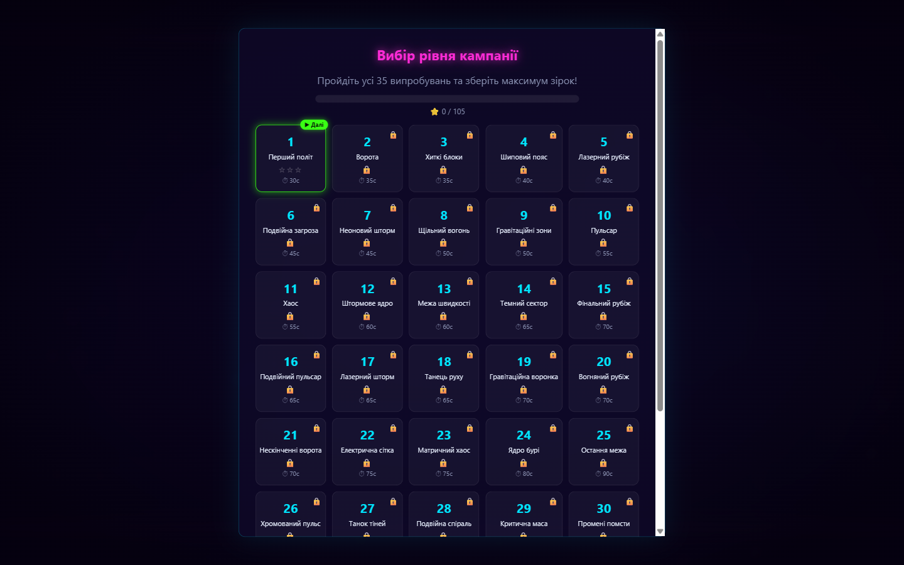
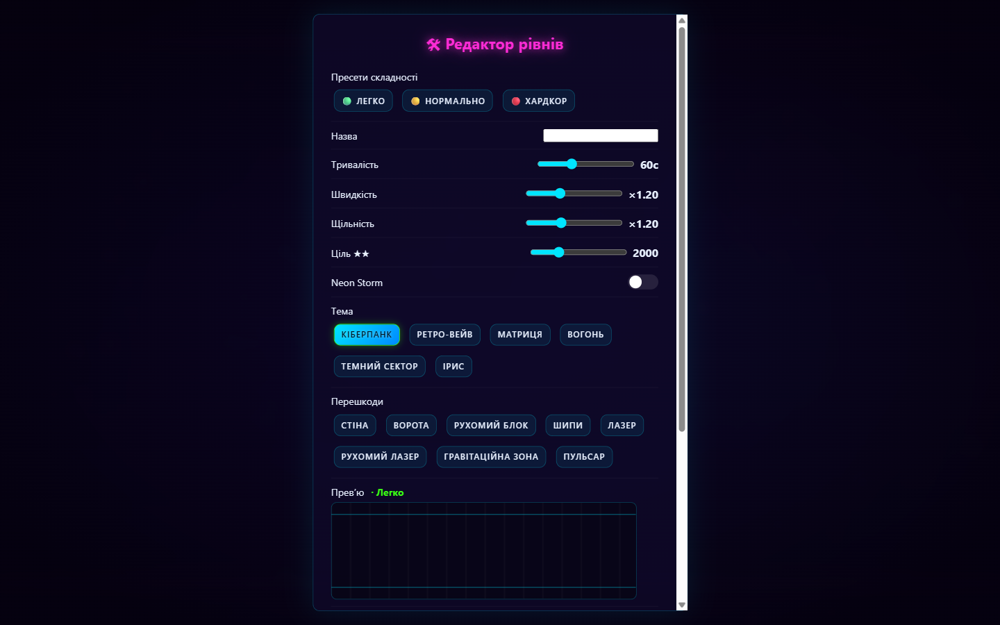
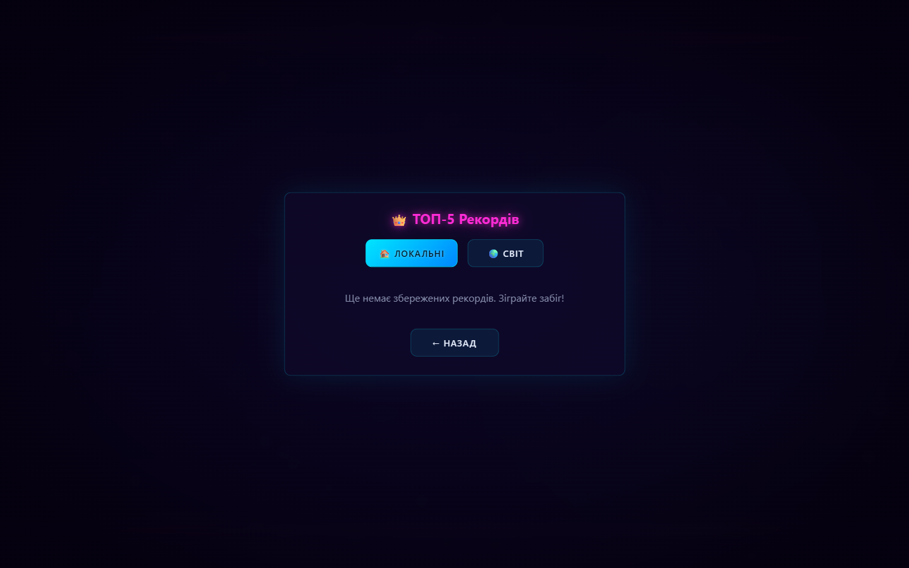
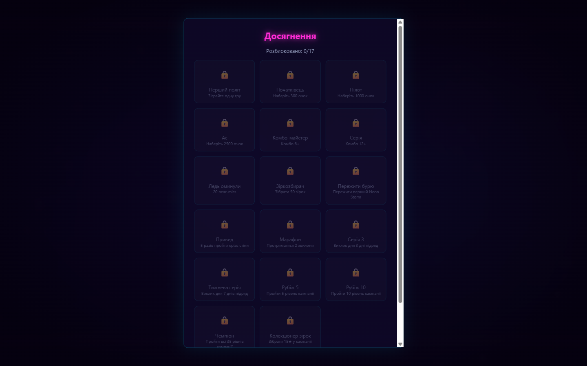

# 🎮 Neon Gravity Runner

[](https://neon-gravity-runner.vercel.app)
[](https://vercel.com/new/clone?repository-url=https%3A%2F%2Fgithub.com%2Folexandrmykhailovskyi-oss%2Fneon-gravity-runner)
[](LICENSE)
[](https://developer.mozilla.org/uk/docs/Web/JavaScript)
[](https://developer.mozilla.org/uk/docs/Web/API/Canvas_API)
[](.)
[](test_smoke.js)



**▶ [Грати онлайн](https://neon-gravity-runner.vercel.app)** — без реєстрації, встановлюється як PWA та працює офлайн після першого візиту.

> **Neon Gravity Runner** — браузерна неон-аркада на чистому JavaScript (Canvas 2D, без зовнішніх бібліотек та бандлерів).  
> Керуй неоновою частинкою, що мчить крізь кібер-тунель: перемикай гравітацію, долай усі 35 рівнів кампанії, збирай зірки, бонуси та тримай комбо!

---

## 📸 Скриншоти

| Головне меню | Кампанія — 35 рівнів | Редактор рівнів |
|---|---|---|
|  |  |  |

| Світовий лідерборд | Досягнення |
|---|---|
|  |  |

---

## 🚀 Деплой на Vercel

Гра — статичний сайт без збірки, тому Vercel працює з нульовим конфігом (усі потрібні налаштування вже в `vercel.json`).

### Варіант 1. Через сайт (найпростіше)

1. Відкрийте **https://vercel.com/new**
2. Натисніть **Import Git Repository** та оберіть `olexandrmykhailovskyi-oss/neon-gravity-runner`
3. Натисніть **Deploy** — все, гра буде доступна за адресою `https://<ім'я-проєкту>.vercel.app`

### Варіант 2. Через CLI

```bash
npm i -g vercel
vercel login
vercel --prod
```

> ⚙ Автоматичний деплой з Git **вимкнено** (`git.deploymentEnabled.master = false` у `vercel.json`).
> Продакшн оновлюється тільки вручну — командою вище або слеш-командою `/deploy-Vercel`
> (вона спершу ганяє смоук-тести і не випускає червоний код).

---

## 🕹️ Локальний запуск

- **Прямий запуск**: відкрийте `index.html` двічі клікнувши у провіднику (`file://`).
- **Локальний сервер**: запустіть розширення Live Server у VS Code або скористайтеся вбудованим сервером Python:
  ```bash
  python -m http.server 8080
  ```

---

## 🧰 Розробка та якість коду

Гра не має runtime-залежностей; для розробки потрібен лише Node 20+.

```bash
npm install         # devDependencies: ESLint, Prettier, Playwright
npm test            # смоук-тести логіки (node test_smoke.js)
npm run test:e2e    # E2E у справжньому браузері (Playwright)
npm run lint        # ESLint (flat config), 0 problems
npm run format      # Prettier за .prettierrc
```

CI (`.github/workflows/test.yml`) на кожен push/PR ганяє **три джоби: лінт, смоук-тести та E2E**.

---

## 🎯 Керування

| Дія | Клавіша / Жест |
|---|---|
| **Перемикання гравітації** | `SPACE` / лівий клік / тап по екрану |
| **Пауза** | `ESC` або кнопка ⏸ на HUD |
| **Швидкий рестарт** | `R` (на екранах Game Over, Перемоги чи Паузи) |

---

## 🏗 Архітектура проекту

Модульна структура на чистому JS (без модульних бандлерів, працює навіть через протокол `file://`):

> 📚 Детальніше: [docs/ARCHITECTURE.md](docs/ARCHITECTURE.md) — модулі, порядок скриптів, ігровий цикл, точки розширення.

```
neon_gravity_runner/
├── index.html                  # Головна сторінка, HUD, екрани, порядок скриптів
├── style.css                   # Неоновий кіберпанк дизайн, адаптивні стилі
├── vercel.json                 # Конфіг деплою Vercel (статика + безпекові заголовки)
├── package.json                # Скрипти (test/lint/format/e2e) + devDependencies
├── eslint.config.mjs           # ESLint (flat config) для класичного браузерного JS
├── .prettierrc / .editorconfig # Єдиний стиль коду, .nvmrc = Node 20
├── jsconfig.json               # IntelliSense з JSDoc (без TypeScript)
├── playwright.config.js        # Конфіг E2E-тестів
├── test_smoke.js               # Смоук-тести логіки (node test_smoke.js)
├── e2e/                        # Playwright: статичний сервер + сценарії
├── supabase/
│   └── schema.sql              # Схема БД: user_progress, scores (+submit_score), analytics
├── docs/
│   ├── ARCHITECTURE.md         # Архітектура: модулі, порядок скриптів, ігровий цикл
│   ├── SUPABASE.md             # Серверна частина: таблиці, RLS, submit_score
│   └── media/                  # Скриншоти гри та og:image
├── LICENSE                     # Ліцензія MIT
├── .gitignore                  # Ігнорування службових файлів
├── core/
│   ├── logger.js               # Тихий кільцевий буфер логів (без console.log)
│   ├── safe_storage.js         # Безпечне сховище (localStorage з fallback у пам'ять)
│   ├── state.js                # Єдине джерело правди, сейви, налаштування, рекорди
│   ├── config.js               # Заморожені константи: 35 рівнів, фізика, досягнення
│   ├── utils.js                # Математика, форматування, Mulberry32 PRNG для Daily
│   ├── collision.js            # Геометричні колізії (circle-rect, circle-circle)
│   ├── cloud_storage.js        # Хмарна синхронізація прогресу (Supabase SDK з CDN)
│   ├── global_scores.js        # Світовий лідерборд: submit/top (таблиця scores)
│   ├── analytics.js            # Анонімна телеметрія подій (батчі, analytics_events)
│   ├── boot.js                 # Контроль модулів та завантажувальний екран
│   └── main.js                 # Глобальний життєвий цикл та обробники помилок
├── fx/
│   ├── audio.js                # Процедурний Web Audio синтезатор (ембієнт + SFX)
│   ├── particles.js            # Пул частинок (підтримка форм трейлів для скінів)
│   ├── floating_text.js        # Плаваючий текст комбо та бонусів
│   ├── background.js           # Багатошаровий паралакс-фон (6 тем)
│   └── effects.js              # Shake, flash, slow-mo, hit-stop
├── gameplay/
│   ├── player.js               # Фізика гравця (імпульс 420, зсув трейла)
│   ├── obstacle.js             # Фабрика 8 типів перешкод (вкл. gravity_zone, pulsar)
│   ├── obstacles.js            # Спавн за фільтром типів поточного рівня
│   ├── bonus.js                # Фабрика 8 бонусів (вкл. revive, phase)
│   ├── bonuses.js              # Менеджер бонусів
│   ├── storm.js                # Neon Storm (одиничні, подвійні, бос-шторми)
│   ├── scoring.js              # Очки, комбо, спецефекти кожні 5 комбо
│   ├── levels.js               # Менеджер 35 рівнів Кампанії та розрахунок зірок
│   ├── modes.js                # Конфіги режимів: Time Attack, Survival, Zen
│   └── game.js                 # Головний ігровий цикл (кампанія, endless, daily, custom)
└── ui/
    ├── ui.js                   # Безпечний DOM-маніпулятор
    ├── screens.js              # Екрани меню, вибір 35 рівнів, перемога із зірками, ТОП-5
    ├── editor.js               # 🛠 Редактор рівнів: конструктор, коди NGRL1, «Мої рівні»
    ├── hud.js                  # HUD з таймером, прогрес-баром рівня та бейджами
    ├── input.js                # Обробник клавіш та автопаузи при зміні вкладок
    ├── skins.js                # 8 скінів із різними формами частинок трейлу
    └── achievements.js         # 17 досягнень пілота
```

---

## ✨ Особливості та контент

- **⭐ Кампанія з 35 рівнів**: унікальні випробування, таймери тривалості, щільність перешкод, шторми та оцінка у 1–3 зірки.
- **♾ Нескінченний режим** та **📅 Щоденний виклик (Daily Challenge)** із фіксованим сідом для кожного дня.
- **8 типів перешкод**:
  - `wall` — статичні блоки;
  - `gate` — ворота з проходом;
  - `moving` — вертикально рухомі блоки;
  - `spikes` — шипи на стелі та підлозі;
  - `laser` — стаціонарні імпульсні лазери;
  - `moving_laser` — рухомі лазери;
  - `gravity_zone` — вихрові воронки, що інвертують гравітацію на 3с без шкоди;
  - `pulsar` — пульсуючі блоки з динамічним хітбоксом.
- **8 бонусів**:
  - `★ Зірка` (+50 очок);
  - `⛨ Щит` (поглинає 1 удар);
  - `◷ Slow-mo` (сповільнення часу на 3с);
  - `×2 Дубль` (подвоєння очок на 8с);
  - `M Магніт` (притягування зірок на 8с);
  - `G Привид` (прохід крізь перешкоди на 5с);
  - `♥ Друге життя` (воскресіння з 2с невразливості при смерті);
  - `⚡ Фаза` (миттєвий прохід крізь перешкоди на 0.8с зі спідлайнами).
- **🎵 Процедурна музика**: генеративний ембієнт на Web Audio API із тривожним шаром під час Neon Storm.
- **🎨 8 скінів** з індивідуальними формами трейлів (коло, іскра, зірка, квадрат, діамант) та **6 неонових тем**.
- **👑 ТОП-5 локальних рекордів** та повна статистика польотів.
- **🔥 Серія викликів дня** (daily streak) — грайте щодня та підтримуйте серію.
- **☁ Хмарна синхронізація прогресу** через Supabase (опційно, див. розділ нижче).
- **🌍 Світовий лідерборд** — результати надсилаються у глобальний ТОП-10 (Supabase) і валідуються на сервері (`submit_score`), у рекордах є вкладки «Локальні / Світ» з фільтром за режимами.
- **🛠 Редактор рівнів** — конструктор власних випробувань (тривалість, швидкість, щільність, шторм, тема, набір перешкод) з миттєвим плейтестом, бібліотекою «Мої рівні» та **шаринг-кодами NGRL1** з контрольною сумою.
- **📊 Анонімна телеметрія** — батч-події сесій у Supabase для розуміння ретеншену; вимикається однією кнопкою в налаштуваннях.
- **✨ Плавні анімації** — переходи екранів, каскадна поява меню та плиток, пружні зірки перемоги, відлік рекордів; поважає `reducedMotion`.
- **Налаштування доступності**: Зменшений рух (`reducedMotion`), 3 рівні складності (**Легко**, **Нормально**, **Хардкор**).
- **🌍 Три мови інтерфейсу**: українська, російська, англійська (автовизначення за браузером).

---

## ☁ Хмара (Supabase): прогрес, світовий рейтинг, телеметрія

Гра опційно інтегрується з [Supabase](https://supabase.com) (безкоштовний тариф вистачає). Без налаштування все працює суто локально.

> 📚 Детальніше: [docs/SUPABASE.md](docs/SUPABASE.md) — таблиці, RLS, валідація `submit_score`, приклади перевірки через REST.

### Підключення за 4 кроки

1. **Створіть проєкт** на [supabase.com](https://supabase.com) → **New project**.
2. **Створіть таблиці** — SQL Editor → вставте вміст [`supabase/schema.sql`](supabase/schema.sql) і виконайте (скрипт ідемпотентний, можна запускати повторно).

   Файл створює `user_progress`, `scores` і `analytics_events`. Світовий лідерборд захищено: **прямого `INSERT` у `scores` для anon немає** — запис іде лише через функцію `submit_score`, яка перевіряє межі очок, правдоподібність темпу набору, режим, нік (чистить HTML-символи) і частоту (не більше 6 результатів/хв з пристрою). Тож накрутити топ простим `insert` із консолі браузера вже не вийде.
3. **Скопіюйте ключі**: Settings → API → `Project URL` та anon-ключ (`service_role` НЕ брати, лише `anon public` / publishable).
4. **Вставте їх в `index.html`** у скрипт `window.NGR_CLOUD_CONFIG = { supabaseUrl: '...', supabaseKey: '...' }`.

Що з'явиться у грі після підключення:

- **☁ Синхронізація прогресу** — автопідхват при старті (злиття «тільки вгору»: зірки/рекорди/досягнення не втрачаються), push після кожного забігу, ручна кнопка в налаштуваннях;
- **🌍 Світовий лідерборд** — задайте «Ім'я пілота» в налаштуваннях, і результати кожного забігу летять у глобальний ТОП (вкладка «Світ» у рекордах);
- **📊 Телеметрія** — анонімні події сесій; вимикається тумблером «Анонімна статистика».

> ⚠ **Безпека**: результати валідуються на сервері через `submit_score` (межі, темп, режим, частота) — пряма вставка в `scores` заборонена на рівні RLS, тож накрутити рейтинг тривіальним `insert` неможливо. Але це не повний анти-чит: клієнт усе ще надсилає свої очки, тож для змагального режиму варто додати Supabase Auth і серверний підрахунок через Edge Function. `user_progress` і `analytics_events` усе ще приймають анонімний запис — для аркади це свідомий компроміс. Політик видалення немає, чистити дані можна з дашборду.

---

## 📜 Ліцензія

Проект поширюється під ліцензією [MIT](LICENSE).